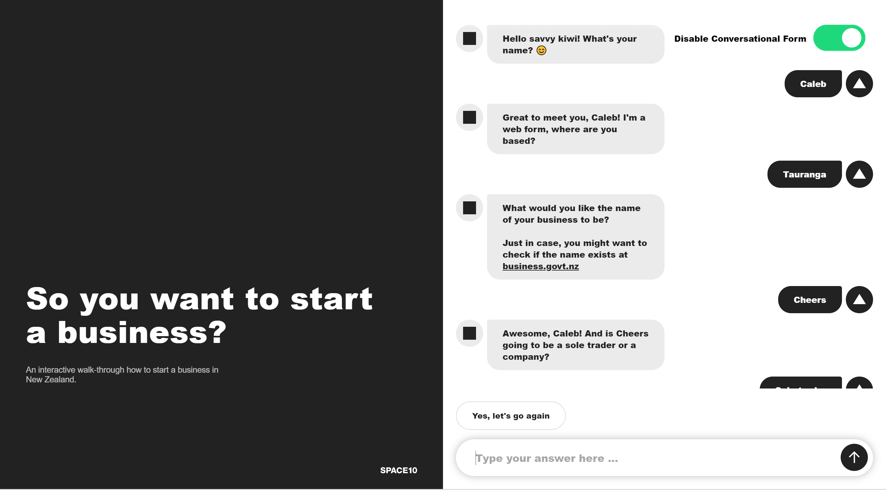

# Start a Business in NZ (Website)

This website is a fork of the `space10-community/conversational-form` project. It implements a simple chat bot for informing kiwis who want to start a business on what requirements they might have for compliance with the complex nz business law landscape.

The rules and research that informed the project are also included in the `/resources/research` directory, and you can find the (currently online) website at https://thinktank.co.nz/startabiz/.

For more information about how the chatbot part works, check out [space10's original github repo](https://github.com/space10-community/conversational-form). We also recommend the [project wiki](https://space10-community.github.io/conversational-form/docs/0.9.80/getting-started/), which was very useful.

## Quick Start

Simply clone the repo and set up a local http server [following this example](http://jasonwatmore.com/post/2016/06/22/nodejs-setup-simple-http-server-local-web-server) (requires npm).

## Other points

- The lions share of the code edits were made in `/landingpage/index.html`. There were less than a handful of javascript edits made in other parts of the repo.

- If you compare [space10-community/conversational-form](https://github.com/space10-community/conversational-form), there were no design changes made (but many attempted - the site is quite large and unwieldy for new people)

- In the `/resources/assets` there are some graphics that we didn't manage to integrate in the time we had. 

- `/resources/research/Question pseudocode.docx` contains the notes that motivated the internal logic for the bot. There are many other levels of regulation that we were unable to cover in the time we had.  

## Acknowledgements

Many thanks to the team at Better Rules Hack 2018, and to all of our team members.